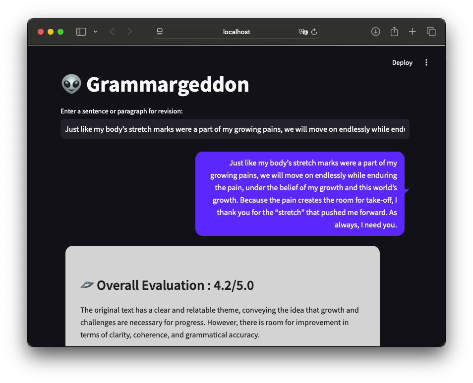

<!-- Improved compatibility of back to top link: See: https://github.com/othneildrew/Best-README-Template/pull/73 -->
<a id="readme-top"></a>
<!--
*** Thanks for checking out the Best-README-Template. If you have a suggestion
*** that would make this better, please fork the repo and create a pull request
*** or simply open an issue with the tag "enhancement".
*** Don't forget to give the project a star!
*** Thanks again! Now go create something AMAZING! :D
-->


<!-- PROJECT SHIELDS -->
<!--
*** I'm using markdown "reference style" links for readability.
*** Reference links are enclosed in brackets [ ] instead of parentheses ( ).
*** See the bottom of this document for the declaration of the reference variables
*** for contributors-url, forks-url, etc. This is an optional, concise syntax you may use.
*** https://www.markdownguide.org/basic-syntax/#reference-style-links
-->

<!-- PROJECT LOGO -->
<br />
<div align="center">

  <h3 align="center">👽 Grammargeddon</h3>

  <p align="center">
    Run your LLM Academic Revision Copilot locally for free!
    <br />
    <a href="http://example.com">View Demo</a>
    &middot;
    <a href="http://example.com">Report Bug</a>
    &middot;
    <a href="http://example.com">Request Feature</a>
  </p>
</div>


<!-- ABOUT THE PROJECT -->
## About The Project



It supports iMessage-like local LLM grammar revision using `llama3.2:3b`. You can easily customize the configuration by editing `config.yaml`.

<p align="right">(<a href="#readme-top">back to top</a>)</p>


### Built With


![Python][Python-shield]
![Streamlit][Streamlit-shield]


<p align="right">(<a href="#readme-top">back to top</a>)</p>


<!-- GETTING STARTED -->
## Getting Started

This is an example of how you may give instructions on setting up your project locally.
To get a local copy up and running follow these simple example steps.

### Prerequisites
1. Install [poetry](https://python-poetry.org/docs/#installing-with-the-official-installer
) to manage the dependencies.
2. Install [ollama](https://ollama.com) and download `llama3.2:1b`
   ```sh
    ollama run llama3.2:1b
    ```
### Installation

Below is an example of how you can instruct your audience on installing and setting up your app. This template doesn't rely on any external dependencies or services._

1. Clone the repo
   ```sh
   git clone https://github.com/euneestella/Grammargeddon.git
   ```
3. Install packages
   ```sh
   poetry install
   ```

<!-- USAGE EXAMPLES -->
## How to Run
```bash
streamlit run app/main.py 
```


<!-- ROADMAP -->
## Roadmap

- [ ] Add additional LLM prompt examples
  - [ ] Add LLM customizing option on streamlit

See the [open issues](http://example.com) for a full list of proposed features (and known issues).

<p align="right">(<a href="#readme-top">back to top</a>)</p>


[Python-shield]: https://img.shields.io/badge/python-3670A0?style=for-the-badge&logo=python&logoColor=ffdd54
[Streamlit-shield]: https://img.shields.io/badge/streamlit%20-%23FF0000.svg?style=for-the-badge&logo=streamlit&logoColor=white